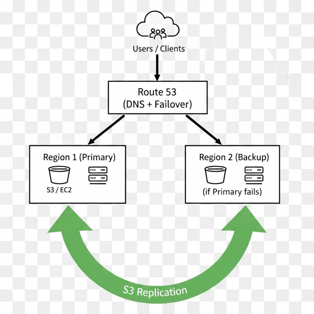
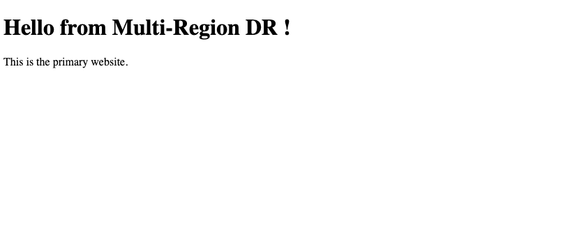
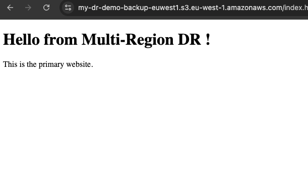
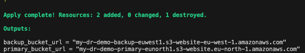
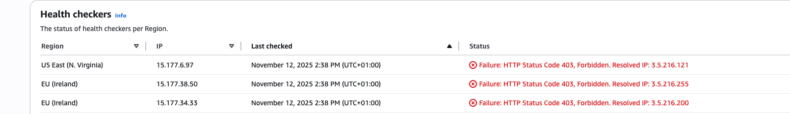
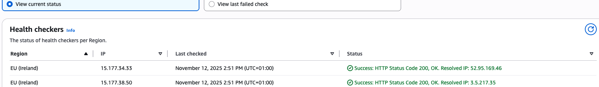
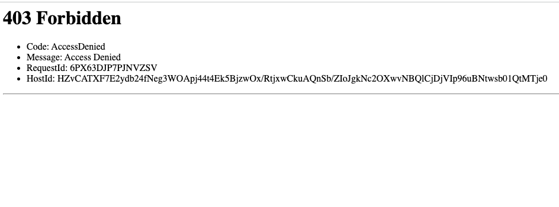
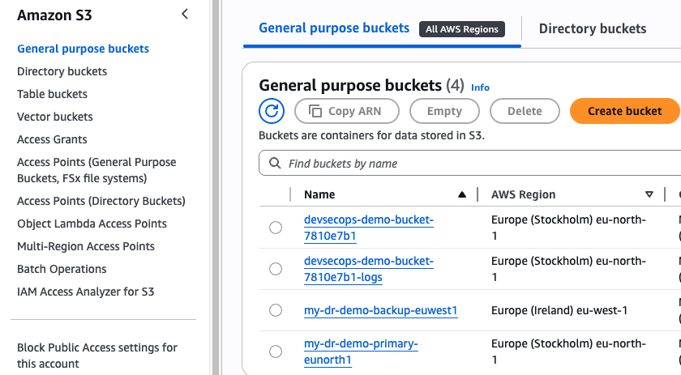

# AWS Multi-Region Disaster Recovery (DR) 

## Project Overview
This project demonstrates a **multi-region disaster recovery setup** using **AWS S3, IAM, and Terraform**. A primary S3 bucket in one region replicates data to a backup S3 bucket in another region. Both buckets host static websites, ensuring **high availability** and **disaster recovery**.

- **Tech Stack:** AWS, Terraform, S3, IAM  
- **Goal:** Implement a DR setup where the backup region automatically holds replicated data from the primary region, and both regions host static websites.

---

## Architecture


**Flow:**
1. Primary S3 bucket hosts the static website.  
2. Versioning is enabled on both buckets.  
3. An IAM role allows **replication** from the primary bucket to the backup bucket.  
4. Terraform provisions all S3 buckets, IAM roles, policies, and replication rules.  
5. Health checks monitor the primary website; in case of failure, traffic can be switched to the backup bucket.  

---

## How It Works

1. **Terraform provisions resources**:
   - Primary S3 bucket in your chosen region  
   - Backup S3 bucket in a different region  
   - IAM role and policy for replication  
   - Bucket replication configuration  

2. **Static website upload**:
   - Upload files to the primary bucket:  
     ```bash
     aws s3 cp ../static-site/index.html s3://<primary-bucket-name>/
     ```
   - Replication automatically copies files to the backup bucket.  

3. - Bucket policies allow public access **only for static website hosting**. All other access is controlled via IAM roles and replication policies. This setup is **read-only** and does not expose sensitive data.


4. **Health checks monitor websites**:
   - If the primary website fails, traffic can be directed to the backup bucket.  
   - DNS failover can be implemented using Route53 health checks.  

5. **Terraform Outputs** provide URLs for verification in your chosen regions.

---
## Screenshots

### 1. Primary Bucket Website


### 2. Backup Bucket Website


### 3. Terraform Apply Output
Terraform provisions all resources and outputs bucket URLs based on your chosen regions.



### 4. Health Check Failure
When the primary website is down, health checks detect failure.



### 5. Health Check Working
When the primary website stopped working, the backup website served traffic seamlessly. Once the primary recovered, the health check confirmed it was back online and serving content correctly.



### 6. Failover Website
Failover mechanism tested by redirecting users to the backup site.



### 7. S3 Buckets Overview


---


## Commands to Run Locally

**Terraform Commands:**
```bash
terraform init
terraform validate
terraform plan
terraform apply
```
## Verify Website

- Open the URLs provided in the Terraform outputs in a web browser.  
- Confirm that both the primary and backup websites are serving the content correctly.  

## Optional Health Check Testing

- Temporarily remove or rename `index.html` in the primary S3 bucket.  
- Observe that the backup website continues to serve the content without interruption.  
- This demonstrates the disaster recovery (DR) failover mechanism in action.

## Why This Project 

- When a single AWS region experiences downtime, websites hosted only in that region can go offline.For example if AWS US-EAST-1 outage    entire websites and applications can go offline if they are hosted in only one region. 
- This project ensures that your static website remains **available even if one region fails**, by automatically replicating data and  enabling **multi-region failover**.  


